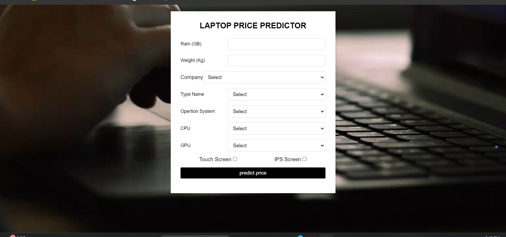

# 💻 Laptop Price Predictor using Machine Learning 🔍

I developed a regression-based machine learning model to predict laptop prices based on features such as processor, RAM, storage, GPU, operating system, and display type. The goal was to enable users to estimate laptop prices accurately based on specifications using a user-friendly web interface.

🔍 **Key Features**  
✅ Predicts laptop prices using key hardware specifications 💻  
✅ Interactive input form built with Streamlit for real-time predictions 🌐  
✅ Clean UI/UX for non-technical users to explore pricing trends 🎯  
✅ Model trained on real-world laptop listings for high reliability 📊  
✅ Handles preprocessing: encoding, outlier filtering, and scaling 🧹

With a combination of data cleaning, feature engineering, and model tuning, this project demonstrates how machine learning can simplify pricing decisions in e-commerce and electronics markets.

💡 Passionate about building real-world ML applications that are practical and intuitive!

---

## 🖼️ App Interface Preview

## 📌 Technical Overview

• Built a regression model using Scikit-learn to predict laptop prices from specs like CPU brand, RAM, storage, GPU, and screen resolution.  
• Conducted EDA to identify important pricing factors and outliers using Seaborn and Matplotlib.  
• Applied feature encoding, log transformation, and pipeline standardization for clean training data.  
• Used GridSearchCV to tune hyperparameters and boost model accuracy.  
• Integrated the trained model with a **Streamlit** web app for live predictions based on user input.  
• Deployed the project locally and made it available for demo testing.

**Tools and Technologies:**  
`Python` | `Scikit-learn` | `Pandas` | `Seaborn` | `Streamlit` | `EDA` | `Regression Modeling`

---

  

